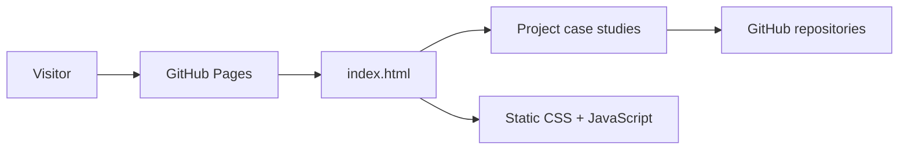

# Engineering Portfolio

A focused portfolio of hands-on work across backend systems, cloud infrastructure, automation, and reliability.

**Live site:** https://gabbyb-cloud.github.io/

## Why this portfolio exists

The portfolio focuses on technical work that is difficult to capture in a resume alone: troubleshooting systems, testing failure behavior, measuring performance, working with infrastructure, and documenting how recovery actually works. A small set of public projects provides enough technical detail to review the engineering decisions, tradeoffs, and results.

## What it highlights

- Linux operations and troubleshooting
- Kubernetes, Helm, Docker, and Terraform
- Cloud and infrastructure concepts
- Prometheus/Grafana observability
- SLOs, alerting, incident response, and recovery
- Backend APIs and distributed workflows
- PostgreSQL, Redis, connection pooling, and performance testing
- CI/CD and repeatable local environments
- Security and reliability-focused engineering practices

## Featured case studies

### SRE Reliability Lab

A local Kubernetes reliability lab covering Helm deployment, Terraform-managed infrastructure, Prometheus/Grafana observability, a 99% availability SLO, controlled failure injection, alerting, recovery verification, runbooks, and incident documentation.

[View repository](https://github.com/gabbyb-cloud/sre-reliability-lab)

### Linux Operations Lab

A hands-on Linux operations lab covering `systemd`, `journalctl`, processes, permissions, networking, service recovery, host-health inspection, and Bash automation.

[View repository](https://github.com/gabbyb-cloud/linux-operations-lab)

### Order Fulfillment Service

A Temporal-based backend that explores durable workflows, retries, business-vs-infrastructure failure handling, Saga-style compensation, cancellation, authenticated APIs, and crash recovery.

[View repository](https://github.com/gabbyb-cloud/order-fulfillment-temporal)

### Distributed Systems Performance Lab

A FastAPI performance and resilience lab measuring PostgreSQL connection pooling, Redis caching and fallback, concurrency, throughput, average latency, p95/p99 behavior, and dependency failure.

[View repository](https://github.com/gabbyb-cloud/distributed-systems-performance-lab)

## Portfolio architecture



The site is intentionally simple: static HTML, CSS, and JavaScript hosted directly on GitHub Pages. There is no framework, application server, database, or build step required for deployment.

## Design decisions

- **Keep the site fast to review.** The portfolio avoids unnecessary application complexity so the projects stay at the center of the experience.
- **Use dedicated case-study pages.** Each featured project gets space for architecture, reliability decisions, results, and tradeoffs instead of relying on screenshots alone.
- **Link back to source.** Public case studies point directly to their repositories so claims can be checked against the code and documentation.
- **Avoid exposing private work.** Only projects intended for public review are included.
- **Keep deployment simple.** GitHub Pages provides static hosting without a paid service or separate runtime.

## Local preview

From the repository root:

```bash
python3 -m http.server 8000
```

Then open:

```text
http://localhost:8000
```

No package installation or build step is required.

## Project structure

```text
gabbyb-cloud.github.io/
├── assets/
│   ├── css/
│   └── js/
├── projects/
│   ├── distributed-systems-performance.html
│   ├── linux-operations-lab.html
│   ├── order-fulfillment.html
│   └── sre-reliability-lab.html
├── 404.html
├── favicon.svg
├── index.html
├── robots.txt
├── sitemap.xml
└── README.md
```

## Deployment

The portfolio is deployed from the `main` branch using GitHub Pages.

Because it is fully static, deployment does not require an application server, paid hosting service, or build pipeline.

## What I'd improve next

- Keep the case studies synchronized with the strongest results and design decisions in each repository README.
- Add lightweight accessibility and performance checks to CI so changes to the portfolio are automatically validated.
- Continue refining the site around clarity and quick review rather than adding features that do not help someone understand the work.
